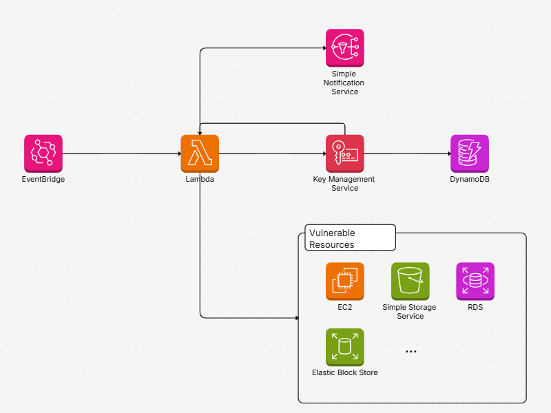

# 🔐 AWS Cloud Security Audit with Event-Driven Lambda

## 📌 Overview

This project is an **Event-driven AWS cloud security audit system** designed to run scheduled scans for finding common misconfigurations across AWS resources, including:

- **S3 Buckets** (e.g., public access, encryption, versioning, overly permissive policies )
- **EC2 Instances** (e.g., sensitive ports exposure, like SSH)
- **RDS Databases** (e.g., public access, encryption checks, IAM auth)
- **EBS Volumes** (e.g., unencrypted volumes)

It uses **AWS Lambda**, **EventBridge**, **SNS**, and **DynamoDB**, all managed with **Terraform Infrastructure as Code (IaC)**.

---
## Setup Instructions

1. Clone the Repository

```bash
git clone https://github.com/adityamurali155/lambda-security-scanner.git
cd lamda-security-checker/
```
2. Setup Environment variables

Make a terraform.tfvars file and add you email to recieve alerts on

```bash
alert_email=[email]
```
Export it locally on CLI
```bash
export alert_email=[email]
```
3. Deploy with Terraform
```bash
terraform init
terraform plan
terraform apply
```

## 🚀 Features

- ✅ Automated and scheduled security checks (Daily at 5pm UTC)
- 📝 Findings stored in DynamoDB for tracking and audit
- 📬 Real-time alerts sent to security teams via SNS
- 🔐 KMS encryption for findings stored in DynamoDB table
- 🔄 Modular architecture for easy extension (add new services or checks)
- ☁️ Fully reproducible with Terraform

---

## 🛠️ Architecture Diagram


